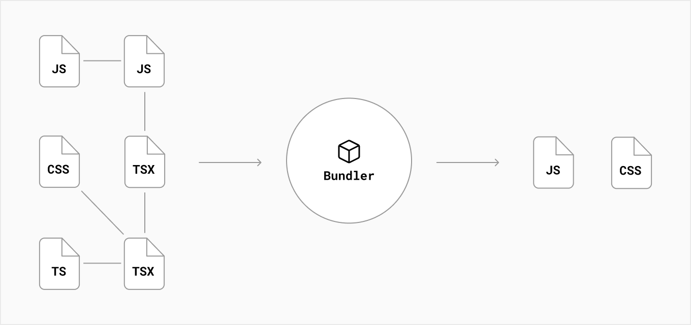

This is a starter template for [Learn Next.js](https://nextjs.org/learn).

## Compiling

taking code in one language and outputting it in another language or another version of that language.

in next, compilation happens during development and as part of the build step. (browser 唔識睇 jsx)

 

## Minifying

comments, spaces, indents and multiple lines are not necessary for the code to run.

it improve the performance of applications by reducing the file size.

 

## Bundling

做野個陣拆開哂，bundle 個陣合返埋

resolve dependenciesand merge (or package) the files (or modules) into optimized bundle, reduce number of requests for files

 

## Code Splitting

app 有 multiple pages accessed from different urls, each page is a unique **entry point**.

split bundle into smaller chunks required by different entry point

improve inital load time by only loading the code required to run that page

one page goes down, others still alive

- each files inside `pages/` directory will be automatically splitted into its own js bundle

- code share between pages are splitted into another bundle to avoid re-downloading

- after initial page load, it still pre-loading codes of other pages

- dynamic import is another way to manually split

 

## Build Time

steps that prepare the application for production, including:

- html for statically generated pages
- js code for rendering pages on the server
- js code for making pages interactive in the clinet
  -css files

 
## Runtime (or Request time)

application runs in response to user's request, after the application is built and deployed

## Rendering

converting react code into html representation of UI

### Pre-rendering

server-side rendering and static site generation

fetching of external data and transformation happens before the result is sent to client

### Server-side rendering

html of page is generated on server on each request

`hydration`: on clinet, html is used to show non interactive page, while react use json data and javascript instruction ti make component interactive

### static site generation

no server at runtime, content generated once, html is stored at cdn and reuse for each request

can use `incremental static regeneration` to update after the site is built

### Client side rendering

 

## Network

### Origin Servers

main computer that stores and runs the original version of application

it does computation before sending a response, which result can be moved to a CDN

### Content Delivery Network

CDNs store static content around the world

when a request comes in, closet CDN location will respond with the cached result

### Edge

fringe (or edge) of the network?

edge servers can run small snippets of codes
unlike CDNs, which only stores static content

caching and code execution can be done at edge closer to user

## Next

### link

pages and routing is integrated

link: client side navagation

it means the page transitions happens using javascript, while a link will reload the whole page

static assets store in the public directory

### images

image are not optimized at build, but on demand

lazy loaded by default, which means speed is not penalized for images outside viewport, images are load as they are scrolled into viewport

### css

css module locally scope css at component level by automatically create unique class name

\_app.js, is a top-level react component

global css affect all elements on the page

utility-first CSS

utility classes can be resued throughtout the application

writing css selector rather than a method

next js compiles css using postcss

 

### Pre-rendering

default: next js prerenders every page `HTML` (純 react 無 pre-rendering)

`hydration`: when page loaded by browser, `js` runs and makes it interactive

## Static Generation

html generate at build time

`getStaticProps` runs at build time in production, run on every request in development

It won’t even be included in the JS bundle for the browser

## server-side rendering

prerender and generate html at each request

`getStaticProps`

## Dynmic Routes

## environemntal variables

access through process.env

default are only available in nodejs environment

too expose to browser, have to prefix with NEXT_PUBLIC\_
